# CTF Writeup - Mr-Robot: 1 (VulnHub)


### Genel Bilgiler

| Alan       | Bilgi                             |
| ---------- | --------------------------------- |
| Makine Adı | Mr-Robot: 1                       |
| Platform   | VulnHub                           |
| Makine IP  | 10.0.2.7                          |
| Zorluk     | Orta                              |
| Tür        | Web Hacking, Privilege Escalation |

#### 1. Keşif Aşaması (Recon)

```bash
netdiscover -r 10.0.2.0/24
```

Hedef makinenin IP adresini bulmak için netdiscover ile IP aralığı taraması yapıyorum. eth0 arayüzünde çalışıyorum ve bu arayüzde subnetmask `255.255.255.0` olduğu için IP range 'ini cidr gösterimi ile `10.0.2.0/24` olarak giriyorum. Çünkü bu alt ağ maskesine göre bu ağdaki cihazların IP adresleri 10.0.2 ile  başlamak zorundadır ve bu rakamlar sabittir. Son hane ise 0 'dan 255 'e kadar değerler alabilir, ancak 10.0.2.255 broadcast tarafından, 10.0.2.0 ya da 10.0.2.1 de (ilk IP adresi) ağ geçidi tarafından kullanıldığından bu ağdaki cihazlara atanabilecek toplamda 254 IP adresi değeri bulunur. netdiscover ile 10.0.2.0 'dan 10.0.2.255 'e kadar olan tüm IP adreslerini tarayıp hedef hostun hangi IP adresi üzerinde çalıştığını buluyorum.


Hedef IP: 10.0.2.7


```bash
nmap 10.0.2.7 -sS -sV -p-
```

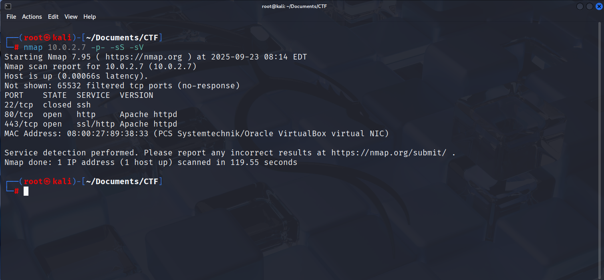

##### Portlar

- 22/tcp ssh closed
- 80/tcp http open
- 443/tcp https open

Sunucu web yayını yapıyor. Firefox web tarayıcısını açıyorum ve `http://10.0.2.7` adresine gidiyorum ve bizi aşağıdaki web sayfası karşılıyor.

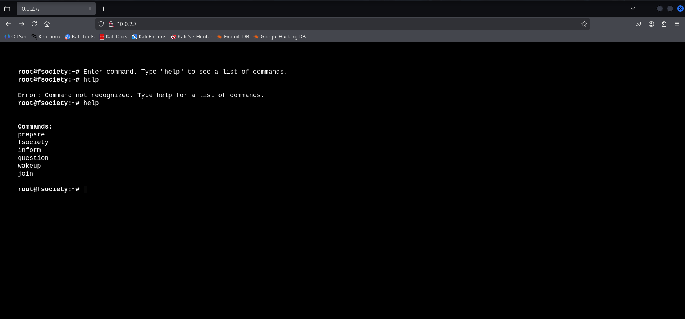

Web sayfası üzerinde bir terminal kullanmamıza izin veriliyor ancak çalıştırabileceğimiz komutlar sınırlı sayıda. Komutları sırasıyla çalıştırdığımda Mr. Robot isimli diziye ilişkin video ve görsellerle karşılaşıyorum. Belki bunlara gizlenmiş ipuçları olabilir ancak gerekirse sonra kurcalarım diyerekten önce klasik web pentesting adımlarını uyguluyorum.

Gobuster çalıştırarak sunucudan servis edilmiş gizli dosya ve dizinler olup olmadığını kontrol ediyorum.

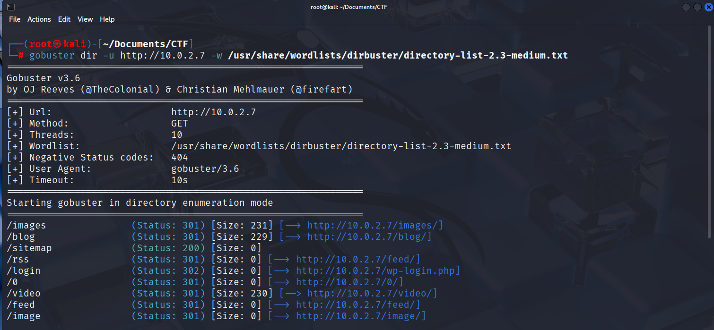

Gobuster taraması devam ederken yeni bir terminalde web sitesine karşı nikto çalıştırıyorum.

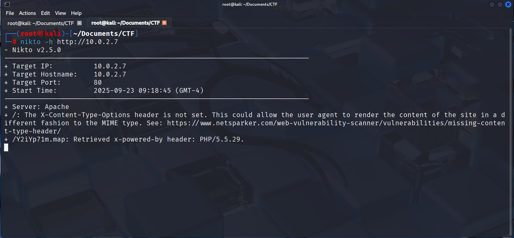

Tarama Sonuçları
-----------------
Kayda değer olabileceğini düşündüğüm alt dosya ve dizinler:

/robots.txt

/wp-login

/admin

/readme

wp-login 'in bulunmuş olmasından bunun wordpress tabanlı bir web sitesi olduğunu anlıyoruz. Bu noktada aklıma gelen wordpress sürümünü öğerenip bu sürümde bilinen bir güvenlik açığı olup olmadığını araştırmak oluyor. Ama önce `http://10.0.2.7/robots.txt` 'ye bir göz atıyorum.

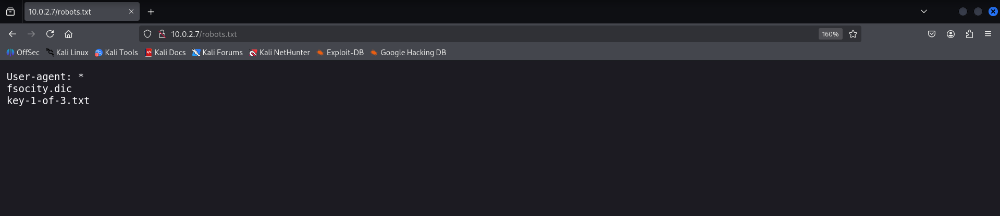

robots.txt; sunucuda bulunan, ancak arama motorlarınca indekslenmesi istenilmeyen dosya ve klasörlerin belirtildiği dosyadır. Görünüşe bakılırsa ilk flag 'i yakalamak üzereyiz. `http://10.0.2.7/key-1-of-3.txt` adresine gidiyorum ve `key-1-of-3.txt` dosyasının içeriğini okuyorum. İlk flag 'i aldık.

Şimdi de `http://10.0.2.7/fsocity.dic` adresine gidiyorum ve karşıma bir wordlist çıkıyor.

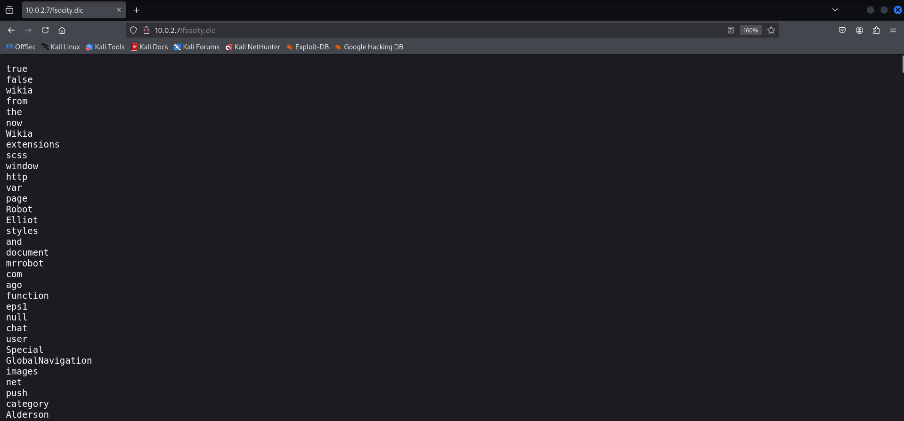

Daha önce bir admin girişi sayfası bulduğumuzu da göz önüne alırsak bu wordlisti muhtemelen giriş formuna brute-force uygulamak için kullanacağız. `fsocity.dic` dosyasını indiriyorum.

```bash
wget http://10.0.2.7/fsocity.dic
```

---

#### 2. Brute Force

Kullanıcı adını bulmak için hydra aracını çalıştırıyorum.

```bash
hydra -V -L fsocity.dic -p test 10.0.2.7 http-post-form '/wp-login.php:log=^USER^&pwd=^PASS^&wp-submit=Log+In:F=Invalid username'
```

İşlemin sonucunda kullanıcı adını `Elliot` olarak buluyorum. Hydra 'yı parolayı bulmayı denemek için de çalıştırdım ancak başarılı olmayınca parolayı wpscan ile buldum.

Ancak öncesinde fsocity.dic dosyasındaki tekrar eden kelimeleri kaldırarak dosya boyutunu küçülttüm. Bu da taramanın daha kısa sürede tamamlanmasını sağladı.

```bash
sort fsocity.dic | uniq > fsocity_clean.dic
```

```bash
wpscan --url 10.0.2.7 --passwords fsocity_clean.dic --usernames Elliot
```

`Parola: ER28-0652`

Ve admin dashboard 'una giriş yaptım.

---

### 3. Sunucu Erişimi Almak

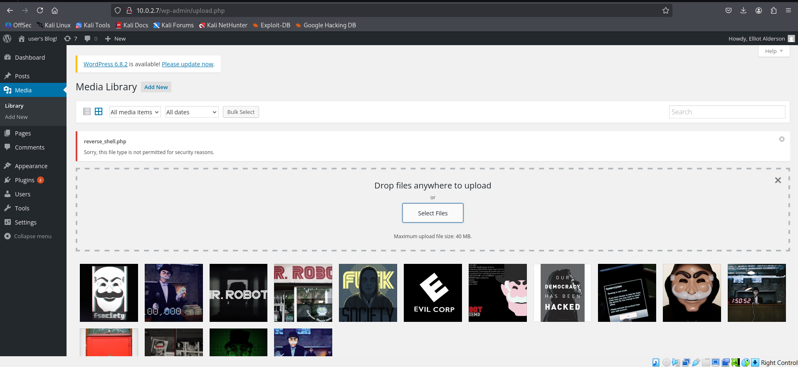

Ben de Appereance > Templates > footer.php dosyasının içeriğini reverse shell koduyla değiştirdim.

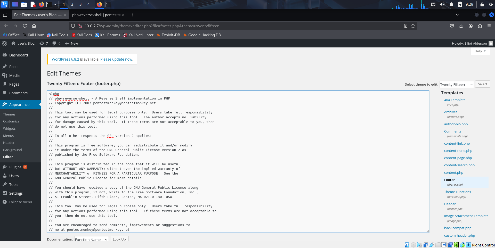

Daha sonra,

```bash
nc -nvlp 1234
```

komutu ile sunucudan kali makineme gelecek olan bağlantıyı dinlemeye başladım.

 `http://10.0.2.7/footer.php` adresine giderek bu php dosyasının sunucu tarafından çalıştırılmasını sağladım ve shell 'i elde etmeyi başardım.

 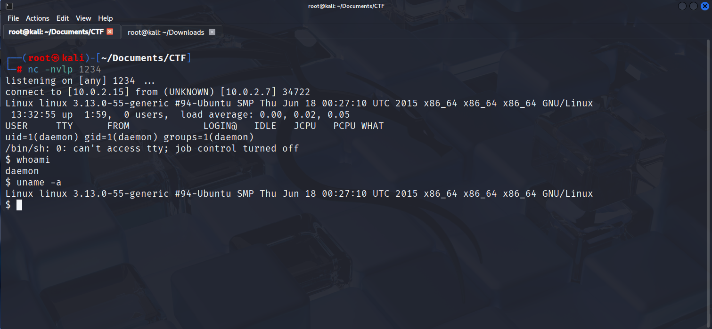

 Artık sunucunun içerisindeyim.

 home dizinine ve onun alt klasörü olan robot dizinine gittiğimde ikinci flag 'in orada olduğunu görebiliyorum ancak daemon kullanıcısı olarak bu dosyanın içeriğini okuma iznimiz yok.

 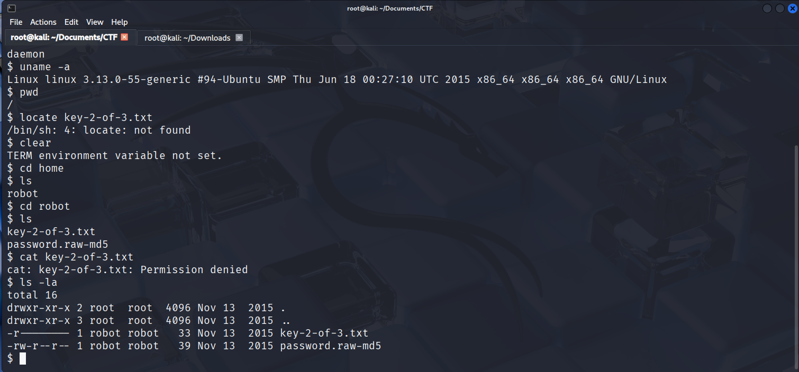

 Görüldüğü üzere bu dosyanın sahibi robot kullanıcısı ve grubu da robot. Dosya sahibi için okuma izni verilmiş olup grup ve diğer kullanıcılar için hiçbir izin verilmemiş. Bu da demek oluyor ki `key-2-of-3.txt` dosyasının içeriğini okumak için ya robot kullanıcısı olarak oturum açmalıyız ya da cat komutunu robot kullanıcısının yetkileriyle çalıştırmalıyız, ya da root olmalıyız.

 ---

 #### 4. Kullanıcı Değiştirme

 `password.raw-md5` isimli bir dosya görüyoruz ve bu dosya için daemon kullanıcısı olarak okuma iznimiz var.

 ```bash
 $ cat password.raw-md5
 robot:c3fcd3d76192e4007dfb496cca67e13b
 ```

 Bu parola muhtemelen robot kullanıcısının parolasının raw-md5 hash 'i. John The Ripper aracını kullanarak bu hash 'i kırmayı deniyorum.

 ```bash
 (root@kali)-[~/Documents/CTF]
 echo robot:c3fcd3d76192e4007dfb496cca67e13b > hash.txt
 ```

 Bu hash 'i kali makineme kaydediyorum. Ardından John The Ripper ile kırıyorum ve robot kullanıcısının parolasını elde ediyorum.

 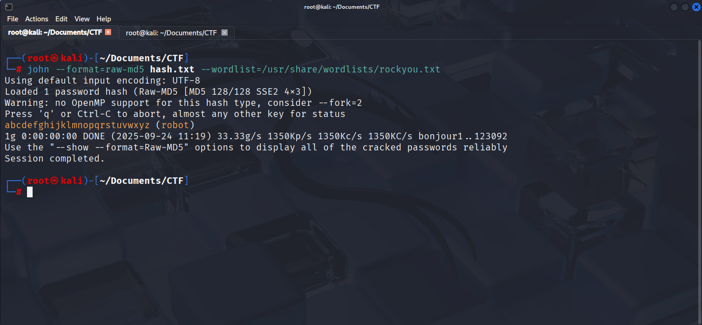

 Ardından kullanıcı değiştirmek için `su robot` komutunu çalıştırıyorum ancak hata ile karşılaşıyorum ve terminali değiştirip komutu tekrar çalıştırıyorum ve robot kullanıcısı olarak oturum açıyorum.

 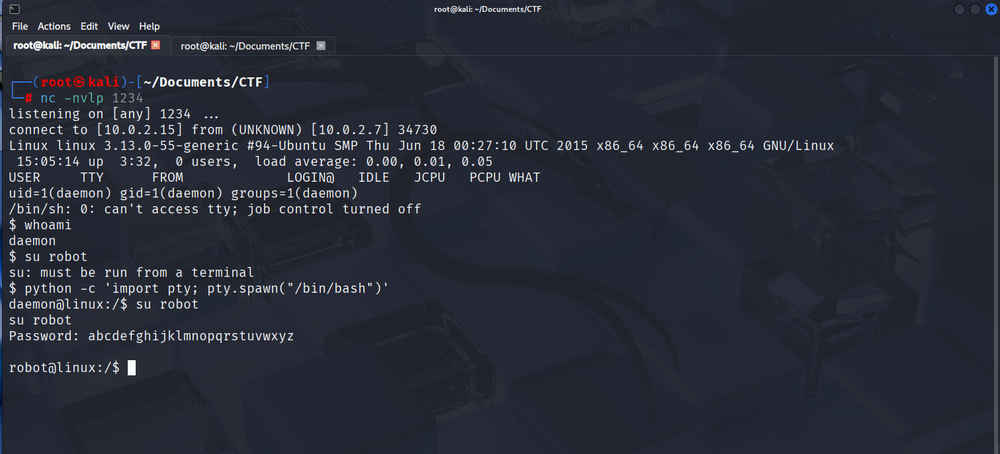

 ```bash
robot@linux:~$ cat key-2-of-3.txt
cat key-2-of-3.txt
822c73956184f694993bede3eb39f959
 ```

 İkinci Flag: 822c73956184f694993bede3eb39f959

 ---

 #### 5. Yetki Yükseltme

 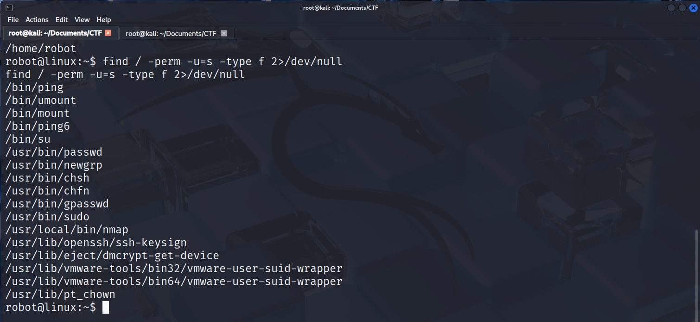

 ```bash
 find / -perm -u=s -type f 2>/dev/null
 ```

 komutu ile bütün dosya sisteminde suid bitine sahip dosyaları listeliyorum. Bu dosyalardan birini yetki yükseltme için kullanacağız. Nmap 'in de suid bitine sahip olduğunu görüyoruz ve yetki yükseltmek için nmap 'i kullancağız.

 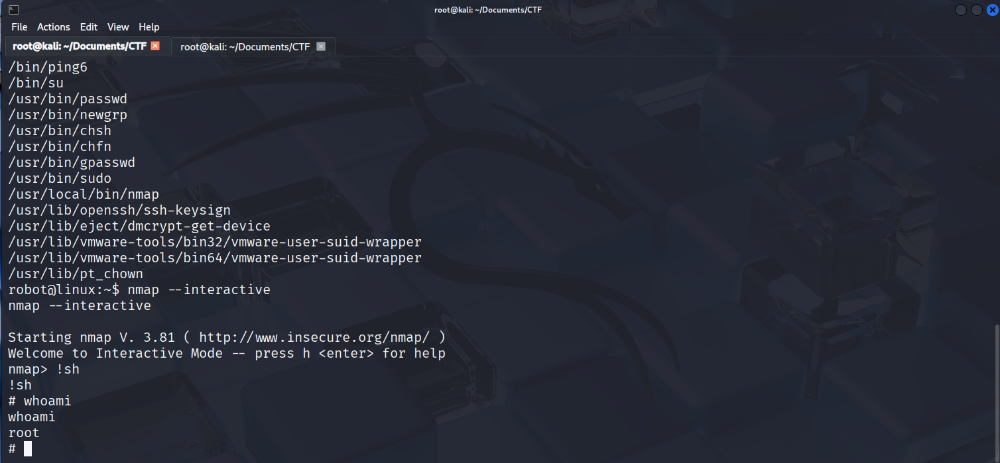

 ```bash
 nmap --interactive
 ```

 komutunu çalıştırdığımda nmap konsolu açılıyor ve bu konsolda da `!sh` çalıştırdığımda bir terminal açılıyor. Açılan bu terminalde ise whoami komutunu çalıştırdığımda terminalin root kullanıcısı olarak açıldığını görüyorum.

 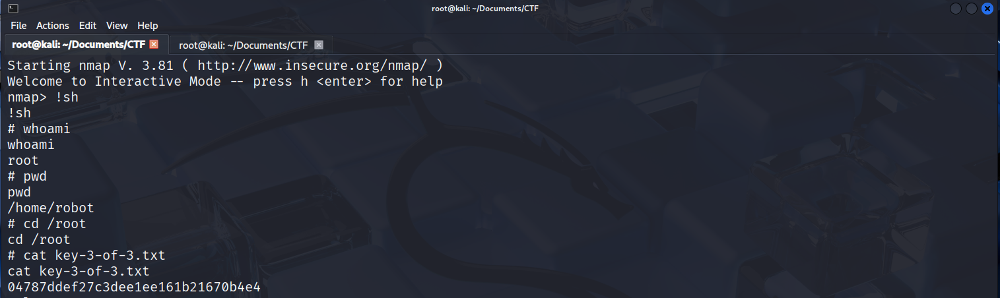


