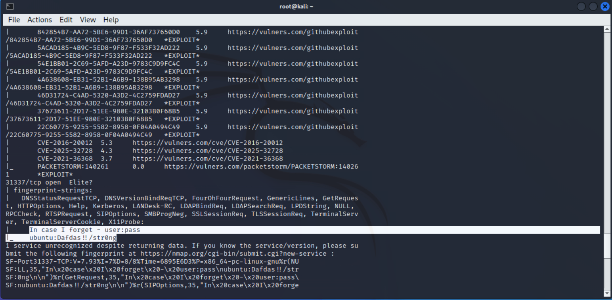
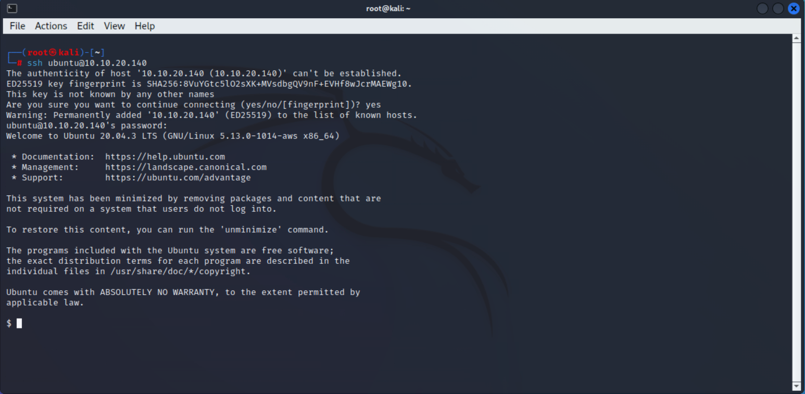
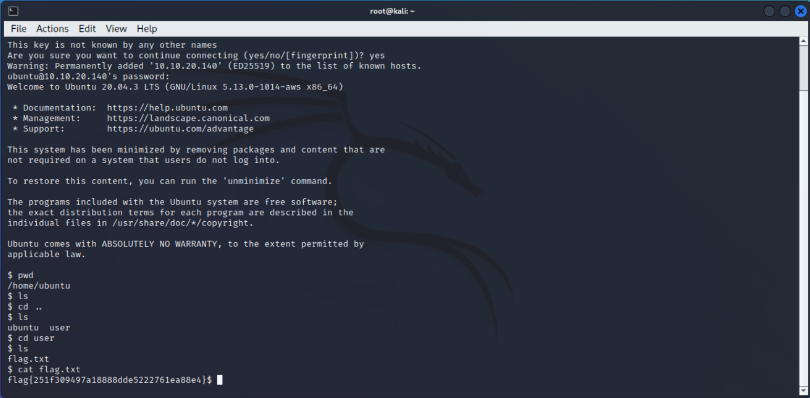

# CTF Writeup - Intermediate Nmap (TryHackMe)

## Genel Bilgiler
| Alan       | Bilgi                 |
| ---------- | --------------------- |
| Makine Adı | Intermediate Nmap     |
| Platform   | TryHackMe             |
| IP Adresi  | 10.10.20.140          |
| Zorluk     | Kolay                 |
| Tür        | Nmap Kullanımı        |

---

## 1. Keşif (Recon)

### Nmap Taraması

```bash
nmap 10.10.20.140 -p- -sV -T5 -v --script=vuln
```

### Açık Portlar
- 22/tcp - SSH
- 2222/tcp - SSH
- 31337/tcp - Elite?



31337 numaralı porttan SSH bağlantısı için gerekli olan kimlik doğrulama bilgileri elde edildi.

username: ubuntu

password: Dafdas!!/str0ng

sunucu IP: 10.10.20.140

---

## 2. Bağlantı Aşaması

```bash
ssh ubuntu@10.10.20.140
```



SSH servisi üzerinden sunucuya başarıyla bağlanıldı. Geriye dosya sisteminde gezinip bayrağı almak kalıyor.

---

## 3. Bayrak



Flag konumu: /home/user/flag.txt

Flag: flag{251f309497a18888dde5222761ea88e4}


---

