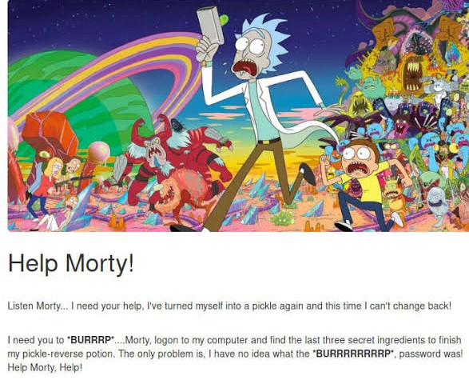
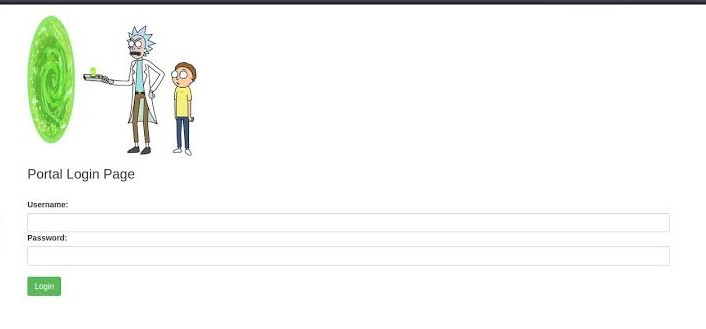

# CTF Writeup - Pickle Rick (TryHackMe)


### Genel Bilgiler

| Alan       | Bilgi       |
| ---------- | ----------- |
| Makine Adı | Pickle Rick |
| Platform   | TryHackMe   |
| Makine IP  | 10.10.42.96 |
| Zorluk     | Kolay       |
| Tür        | Web Hacking |

#### 1. Keşif Aşaması (Recon)

```bash
nmap 10.10.42.96 -sS -sV
```

##### Açık Portlar

- 22/tcp SSH
- 80/tcp HTTP

SSH 'in açık olduğu ve sunucuda web sitesi yayını yapıldığı tespit edildi.

Herhangi bir web tarayıcısı ile`http://10.10.42.96` adresine gidildiğinde web sitesini görüntülüyoruz.



Görünüşe bakılırsa Rick kendini turşuya dönüştürmüş ve yeniden insana dönüşebilmek için bir iksire ihtiyacı var.

Morty 'den kendi bilgisayarına girmesini ve iksiri tamamlamak için son üç gizli bileşeni bulmasını istiyor.

İlk olarak bu sayfanın kaynak kodu incelendi ve html kodlarının arasına yerleştirilmiş bir yorum satırı bulundu. Bu yorum satırı Rick 'in kendine bıraktığı bir hatırlatma notuydu ve bir kullanıcı adı içeriyordu: `R1ckRul3s`

---
#### 2. Dizin Taraması

```bash
gobuster dir -u http://10.10.42.96 -w /usr/share/wordlist/rockyou.txt -x txt, php, html
```

Sunucudan web tarayıcılarına sunulmuş olabilecek potansiyel dizinler ve dosya adları tarandı.

Kayda değer birkaç dizin ve bir dosya bulundu.

- /robots.txt
- /login.php
- /assets

İlk olarak `http://10.10.42.96/robots.txt` adresine gidildi ve dosyanın içeriği okundu: `Wubbalubbadubdub`

Artık elimizde bir kullanıcı adı ve bir de parola vardı.

---
#### 3. Erişim Denemeleri

```bash
ssh R1ckRul3s@10.10.42.96
```

İlk olarak ssh servisi üzerinden direkt olarak sunucuya bağlanmayı denedim. Ancak sunucuya SSH ile şifreli erişim kapalıydı. Sadece özel anahtar ile erişim sağlanabiliyordu. Bu anahtar da benim sistemimde olmadığına göre bulunan parola SSH üzerinde bir işe yaramayacaktı.

`http://10.10.42.96/assets` adresine gidip bu dizinin altındaki resim dosyalarını indirdim.

```bash
binwalk portal.png
binwalk rickandmorty.png
```

gibi komutlarla resim dosyalarının içine gizlenmiş olabileceğini düşündüğüm, SSH için özel anahtarı verebilecek başka dosyalar aradım. Ama yoktu.

Sonra `http://10.10.42.96/login.php` adresine gittim.



Kullanıcı adı ve parolayla başarılı bir giriş gerçekleştirdim. Burada sunucu üzerinde uzaktan kod çalıştırmaya olanak tanıyan bir girdi alanı vardı.

---
#### 4. Flag 'ler

İlk olarak `ls` çalıştırdım. İlk flag, yani gizli formülün ilk bileşeni buradaydı.

Ancak `cat` komutu çalıştırılamadığı için dosyanın içeriğini `less` komutu ile okudum.

```
less Sup3rS3cretP1ckl3Ingred.txt
```

İlk flag: `mr. meeseek hair`


```
less /home/rick/"second ingredients"
```

İkinci flag: `jerry tear`


```
sudo less /root/3rd.txt
```

Üçüncü flag: `fleeb juice`

---


